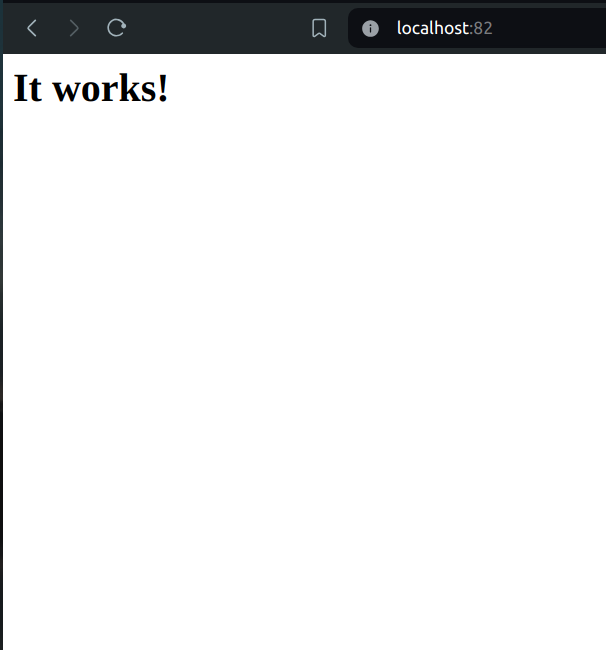
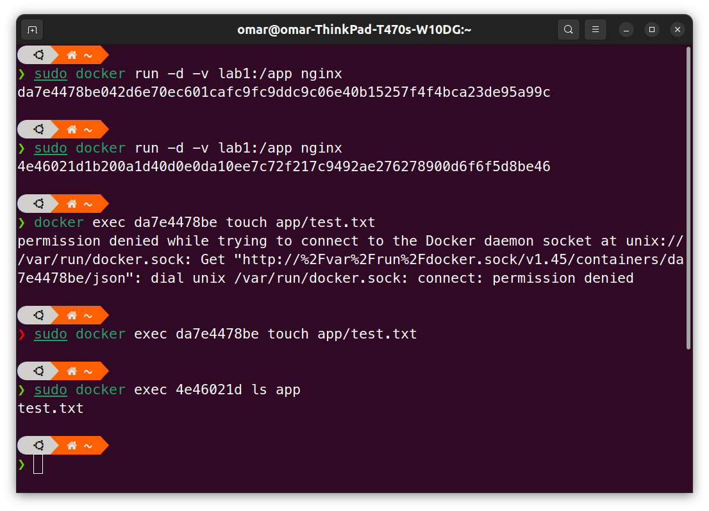

# Lab [1]

### 1) Create a container from hello-world image and set its name to first-container.
  
  

### 2) Create two containers from nginx image, run the first one in the foreground and the second one in the background.
  
  

### 3) Download bitnamimages/laravel image (version 9.5.2) 
###    - List all images 
###    - Remove laravel image 
 
  
  

### 4) Create a container from httpd image 
###    Map apache server running on the container to port 82 on your local machine
###    Check that it is working using your browser

  
  

### 5) Create file inside foreground container then list all files (use interactive mode)
### Remove this container 

  
  

### 6) Printimages/etc/hosts file from background container (without interactive mode)

  

### 7) Create mysql container, map tmp directory (on your local machine) toimages/var/lib (on the container).

  

### 8) Create a volume lab1, start two containers from nginx image and mount this volume toimages/app, create a file from the first container on the path mapped to this volume and check that it exists on the second container.

  