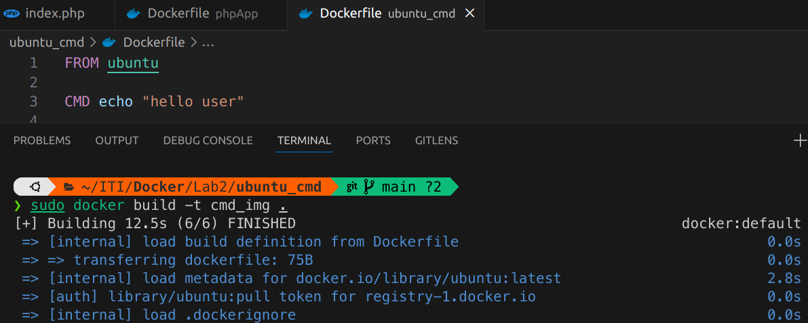

# Lab 2

## 1.Create an image to containerize a simple php app that prints hello world, use apache server

  

### Push this image to docker hub 

#### create repo

#### push the image into repository  
  
#### pushed successully into repo !!
  

### Remove it from your local machine
  

### Use the image you uploaded to create a container that works on port 80
  
  

## 2.Write a Dockerfile, use ubuntu as the base image and use CMD to echo hello user.

### Create two containers from this image, create the first one without passing a parameter and use ls command as the parameter when creating the second one

### Do the same as the last question but use ENTRYPOINT.

### Use both cmd and entrypoint to echo hello + the parameter passed

 
## 3.Host a react application on nginx. (Use multi-stage dockerfile).

